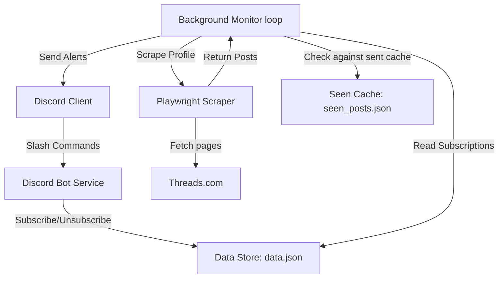

# Design Document: Threads to Discord Notification Bot

This document outlines the complete system design for the **Threads to Discord Notification Bot**, incorporating the proven architecture of the `seventeen_notify_discord_bot` interface.

---

## 1. Objectives

- **Threads Profile Scraping:** Intercept and parse the dynamic React/GraphQL page data of public Threads profiles (e.g. `https://www.threads.com/@username`) using Playwright headless browser automation.
- **Discord Bot Interface:** Run a Discord slash-commands bot (using `discord.py`) that lets servers manage their subscriptions natively.
- **Background Monitor:** Run a background loop that checks subscribed profiles, filters new posts, and pushes notifications to designated channels.
- **Subscription Persistence:** Store subscriptions and already-sent posts locally in a robust JSON format.

---

## 2. System Architecture



---

## 3. Data Models & Persistence

We will maintain two simple JSON-based storage files:

### A. Subscriptions Data (`data.json`)
Tracks the active subscriptions across Discord channels:
```json
[
  {
    "username": "c910335",
    "channel_id": 123456789012345678,
    "server_id": 987654321098765432,
    "message": "Hey {mention}! {name} posted a new update!",
    "mention": "<@&1122334455667788>"
  }
]
```

### B. Seen Posts Cache (`seen_posts.json`)
Prevents sending duplicate alerts:
```json
{
  "c910335": [
    "3934428023188745554_63095361163",
    "3934428012669413235_63095361163"
  ]
}
```

---

## 4. Discord Bot Commands (Reusing Seventeen Notify Interface)

Adapting the slash-command interface to Threads:

- `/subscribe`: Subscribe to a Threads user profile for the current channel.
  - `username` (String): The username of the Threads profile (e.g., `c910335`).
  - `message` (String): The template message to send (supports `{name}`, `{url}`, `{mention}`).
  - `mention` (Mentionable, Optional): The user or role to ping.
  - `overwrite` (Boolean, Optional): Overwrite existing subscription for this channel (defaults to `False`).
- `/unsubscribe`: Remove a subscription.
  - `username` (String): The Threads username to unsubscribe from.
- `/list`: Display all active subscriptions in the current channel (only visible to the caller).
- `/test`: Trigger a manual fetch check and send a test notification.
  - `username` (String): The profile to test.
  - `silent` (Boolean): If true, makes the response ephemeral.

---

## 5. Background Monitor Workflow

The monitor runs as a background task (`discord.ext.tasks` loop) every 5–10 minutes:
1. Load all active usernames from `data.json`.
2. For each username, invoke the **Playwright Scraper**:
   - Launch Headless Chromium.
   - Load `https://www.threads.com/@username`.
   - Extract posts from HTML JSON state using the recursive search utility.
3. Filter posts to select only those published after the initial bot startup/monitoring setup.
4. Compare post IDs against `seen_posts.json`.
5. For any **new** post:
   - Format the notification message with the post URL and text.
   - Send the message to the subscribed Discord channel.
   - Add the post ID to `seen_posts.json` and save.
6. To avoid aggressive scraping and rate limits:
   - Randomize delays between scraping different users.
   - Run the loop at a conservative interval (e.g. 5–10 minutes).
